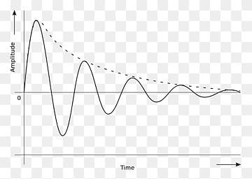

# Piano 
This is a Keyboard Piano consists of 88 keys and 8 octaves. Octave zero has the lowest pitch and on the other side of spectrum, octave eight has the highest pitch. To change the octave, use the calculator buttons on the keyboard. These keys are shown with a green box in the picture. And for playing notes, use the buttons shown with a purple box or an orange box.      

## Calculation
Each note's frequency is calculated using the below formula:

=2^{\frac{n-49}{12}}*4})

Frequency rate is 10KHz and each note is played for 0.5sec. A `damped sine wave` is used to make it more realistic.

})                 
=&space;sin(w)*&space;e^{-0.008w}})

Depending on the octave, the end result looks something like this:

## Sample Notes
- [MP3](assets/sample.mp3)
- [WAV](assets/sample.wav)
